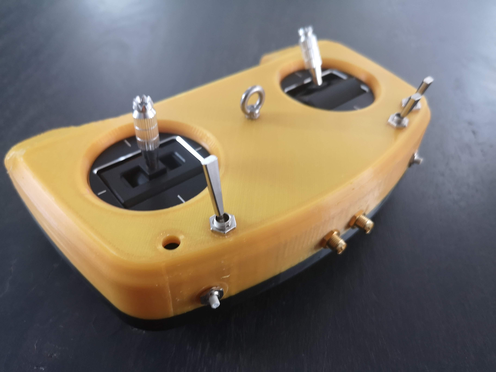
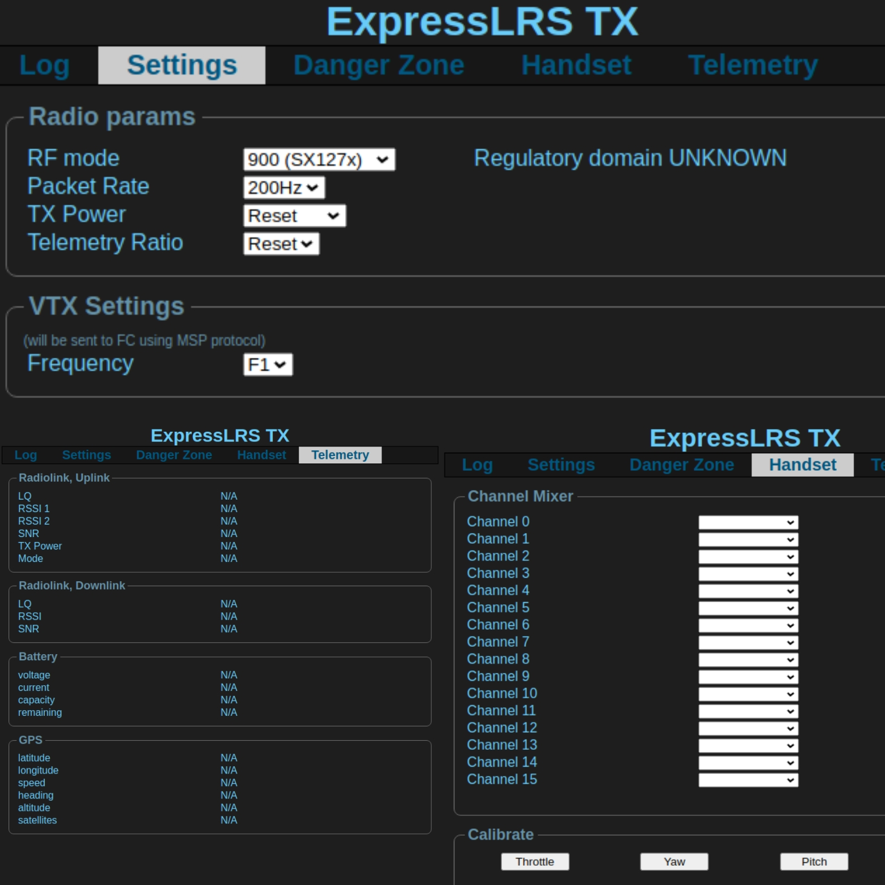
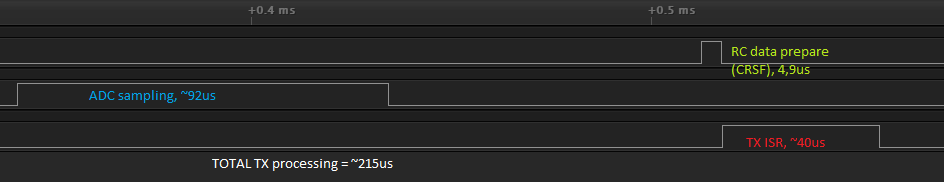
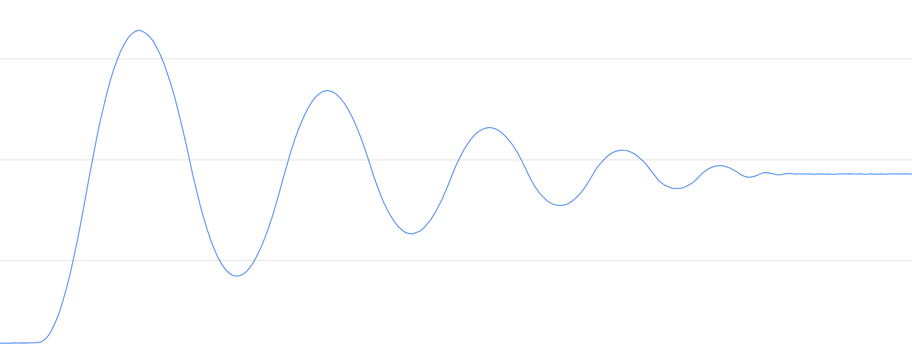

# Handset
Custom DIY dual band (900/2400MHz) transmitter based on ExpressLRS.

# User interface
Handset does not have a dedicated screen to show the value.

It is using ESP8266/8285 as a webserver and it is used to display
overview and adjust setting. It is also used to provide easy firmware
OTA update (STM32 and ESP).

# Latency
This is optimized for speed and latency.

# Filtering
Filtering amount is minimized to avoid extra latency.
Handset is using just oversampling of 4 and measurements
proven that no extra filtering is needed.

# Firmware
This is using modified and optimized great
[ExpressLRS](https://github.com/ExpressLRS/ExpressLRS) firmware.

Current development/experimental version can be found
from [here](https://github.com/cruwaller/ExpressLRS)

NOTE: current firmware version is NOT compatible with original ExpressLRS firmware!
