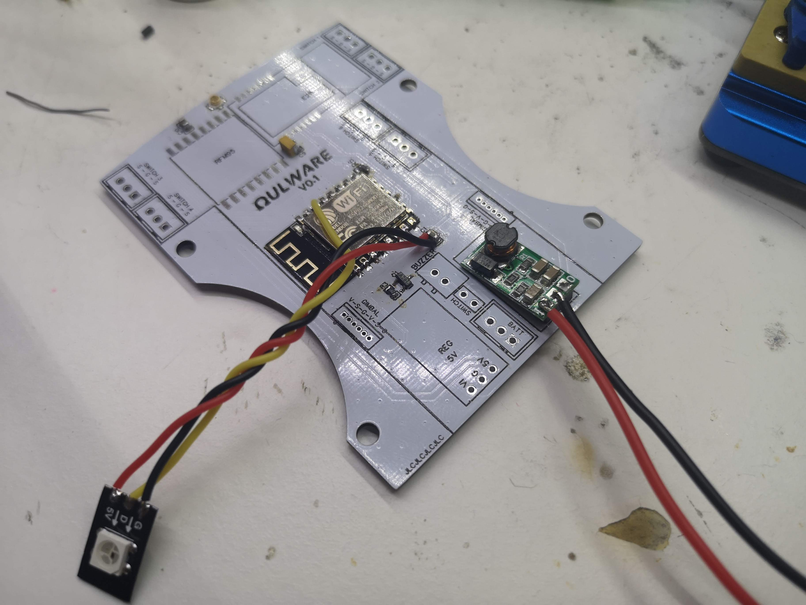
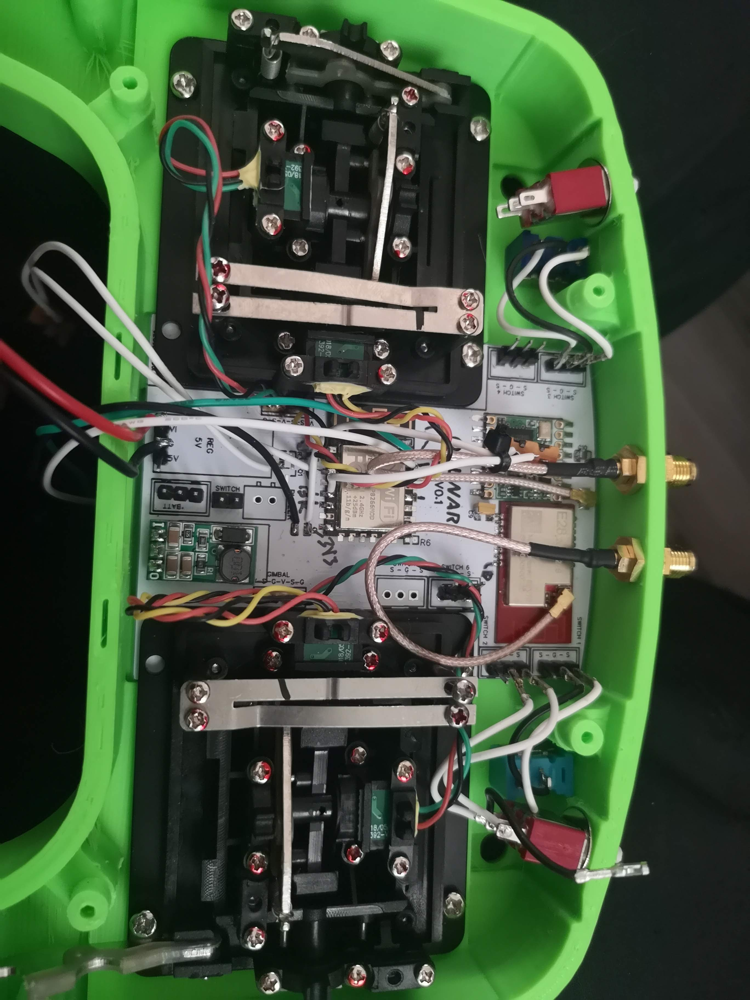

## Shell

Print with your favorit color and material (e.g PETG or PLA).
Good initial values are 
- 0.2mm layer
- 4 perimeters
- 40% infill

## PCB

PCB can be ordered from [JLCPCB](https://jlcpcb.com/RAT) for 2$ / 5pcs. 

Other parts from e.g. Mouser, Digikey, LCSC, TME...

Gerbers and BOM can be found from:
https://easyeda.com/cruwaller/handset

## BOM

- 2.4GHz LoRa module
  - Ebyte E28 [ALIEXPRESS](https://a.aliexpress.com/_mNVQHaD)
- 868/915MHz LoRa module
  - RFM95 [ALIEXPRESS](https://a.aliexpress.com/_msmEOrR) 
  - LoRa1276F30 [ALIEXPRESS](https://a.aliexpress.com/_mseH4Y1)
    - NOTE: this module needs to be modified (info is coming later)
- M7 gimbals [ALIEXPRESS](https://a.aliexpress.com/_mtOVxn3)
- ESP-01F (TODO: add a link)
- 3V3 Regulator [ALIEXPRESS](https://a.aliexpress.com/_m0cXLT7)
- Switches [ALIEXPRESS](https://a.aliexpress.com/_mNrFxCd)
- Pigtails: IPEX -> SMA or RP-SMA
- 2.54mm pin stripes
- WS2812B LED
- Buzzer

## Assembly

TODO...

