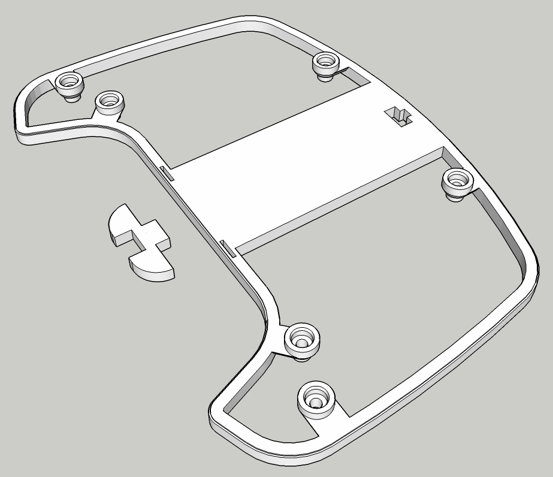
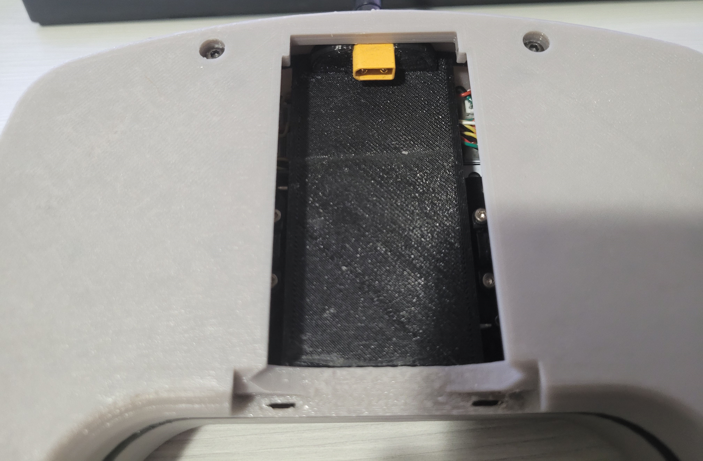
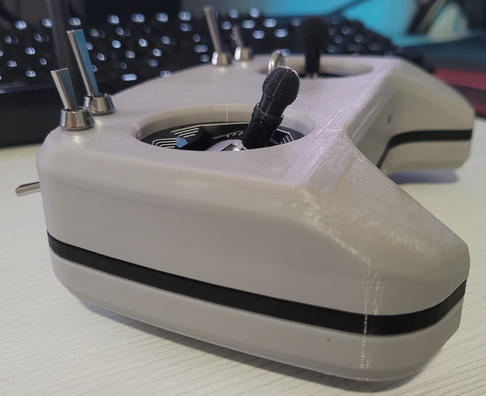

## Thicker Shell Addon

Make Shell thicker by placing this part between Front and Rear shell parts.

- Protects components when battery cover is open
- This part is required when using some taller gimbals, for example AG01
- There is optional part 2 that can be used to mount XT30 or 3-Pin JST inside battery compartment

## Images

